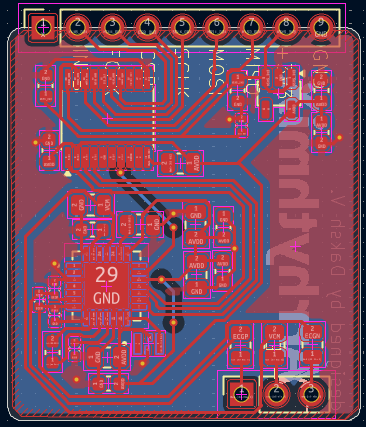
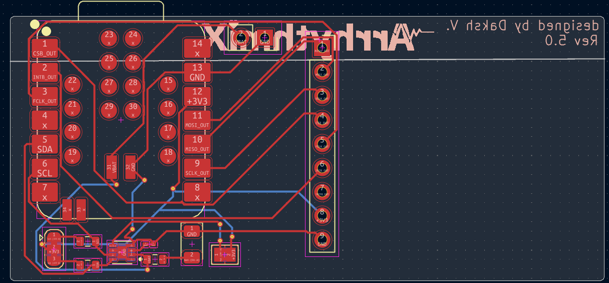
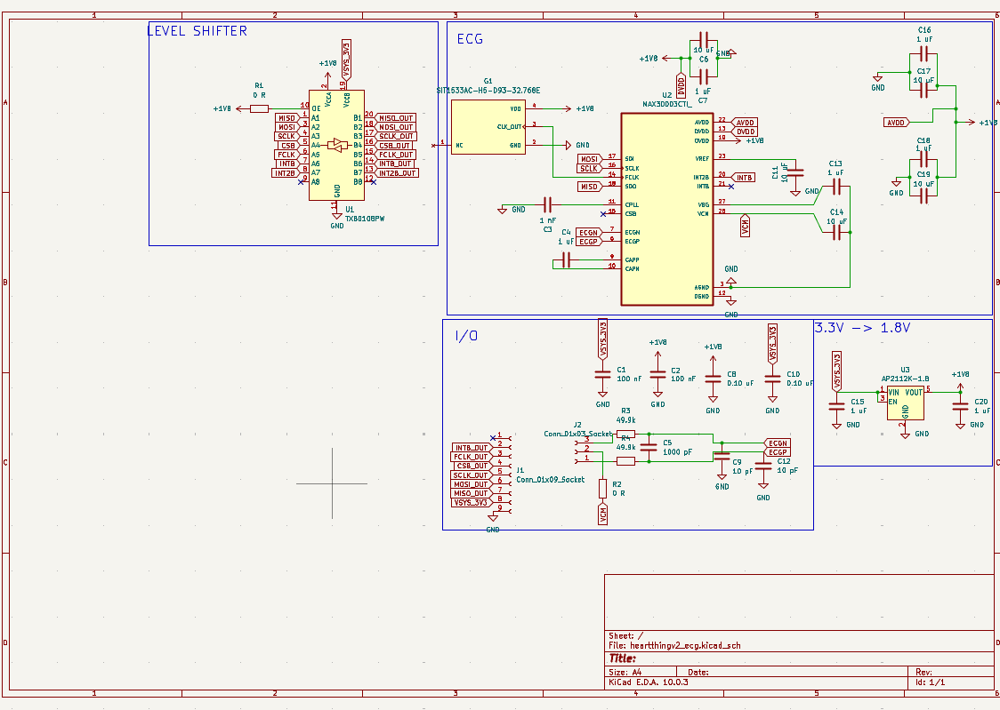
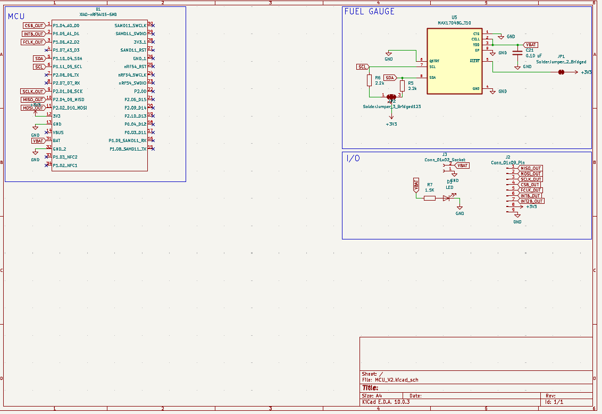
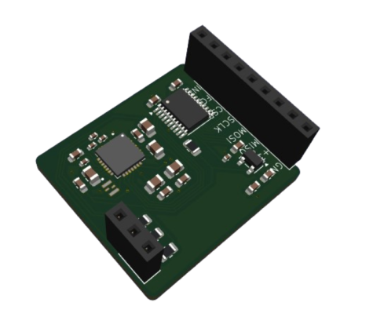
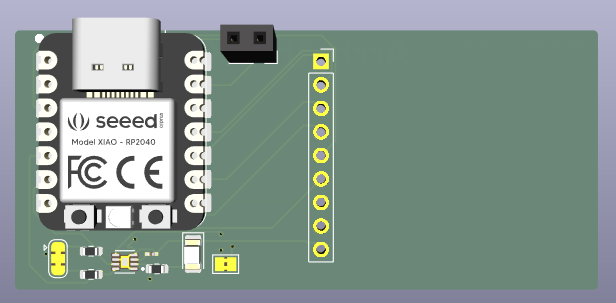
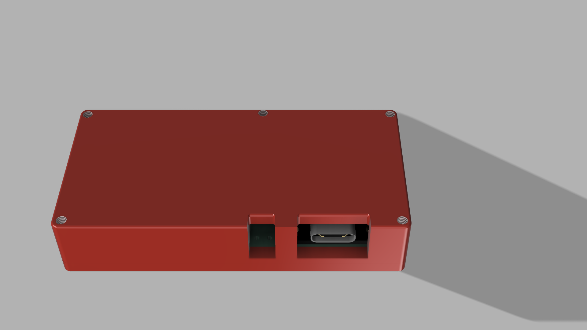
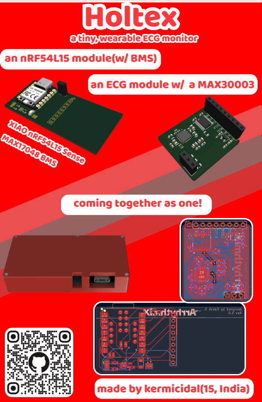

# Holtex

>A tiny, wearable ECG monitor!

# what even is this?
Holtex is an nRF54L15 based holter monitor paired with a MAX30003, a biopotential AFE. It is designed modularly - wherein the MCU module(which just has a xiao nRF54L15 + a MAX17048 i2c fuel gauge) and the ECG module are on completely seperate boards and are joined together by a castellated header. 

the ECG and the MCU communicate over SPI(which, in my opinion is far superior to communicating over simple analog) which opens up a whole new realm of possibilities(and complexities). 

the device is tiny, just taking up 6x3 cm(can go FAR smaller) and is connected to the body via this awesome [electrode belt](https://store.upsidedownlabs.tech/product/heart-bioamp-band/) 

in terms of battery - i'm just using the cheapest thing on hand and it should(in theory) last at least a day, thanks to [ttf's super optimized firmware](https://github.com/TTF-fog/ArrythmiX) 

# why??
i ~~was sold into slavery by a chinese warlord and then ttf forced me to make this~~ requested by my good friend [ttf](https://github.com/TTF-fog) to help him redesign the PCB for their project + test out/evaluate the nRF54 as a viable option - this is also why i'm using their firmware available [here](https://github.com/TTF-fog/ArrythmiX). 
i'll be answering some frequently asked questions below 
**Q - why xiao?** 
because they're tiny and epic, and also because I couldnt figure out how to route antennas and no nRF54 modules were very well documented so i left them  
**Q- why max30003???** 
only because SPI - also because of bad experiences with the ad8232  

# how can YOU assemble this?
1 - use the BOMs, CPLs and gerbers given to print out all of these PCBs and get them both assembled(you can hold on the xiao and solder it yourself)

2 - print both parts of the case(i'm going to try TPU and see how it goes)

3 - place the PCBs in the case and screw the top to the bottom of the case 

4 - feed the electrode belt through the clips 

5 - place the electrode belt right in the center of your torso

6 - connect via Rerun and visualize data!!

# images

PCB images

>ECG PCB

>MCU PCB

Schematic images

>ECG Schematic

>MCU Schematic

3D images

>ECG 3D image

>MCU 3D image

CAD/Renders

>whole thing with case from the front

>fun animation!!

# Zine

